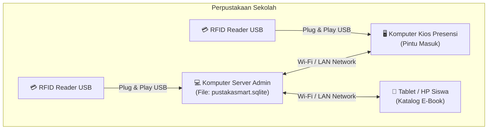
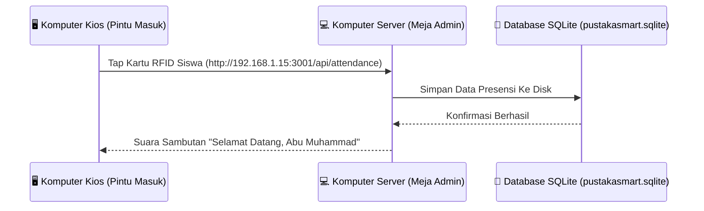
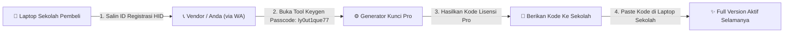

# 📘 MANUAL PANDUAN PENGGUNA & ADMINISTRATOR
## **PustakaSmart RFID School Edition**
### *Sistem Perpustakaan Sekolah Digital, E-Book PDF, RFID & Arsitektur Klien-Server*

---

> [!NOTE]
> **PustakaSmart RFID School Edition** adalah solusi manajemen perpustakaan sekolah modern yang menggabungkan teknologi **Kartu Pelajar RFID**, **Peminjaman Kios Mandiri (Self-Service)**, **E-Book PDF Viewer**, **Database SQLite Terpusat**, dan **Arsitektur Klien-Server Multi-Komputer LAN**.

---

## 📑 DAFTAR ISI MANUAL

1. [Bab 1: Persiapan Hardware & Instalasi Aplikasi](#bab-1-persiapan-hardware--instalasi-aplikasi)
2. [Bab 2: Panduan Konfigurasi Jaringan Klien-Server (Multi-Komputer LAN)](#bab-2-panduan-konfigurasi-jaringan-klien-server-multi-komputer-lan)
3. [Bab 3: Panduan Lisensi HID Harddisk & Aktivasi Pro Vendor](#bab-3-panduan-lisensi-hid-harddisk--aktivasi-pro-vendor)
4. [Bab 4: Panduan Fitur-Fitur Utama Aplikasi](#bab-4-panduan-fitur-fitur-utama-aplikasi)
5. [Bab 5: Pengamanan Data & Backup SQLite Anti-Hilang](#bab-5-pengamanan-data--backup-sqlite-anti-hilang)

---

## 🛠️ BAB 1: PERSIAPAN HARDWARE & INSTALASI APLIKASI

### 1.1 Perangkat Keras (Hardware) Yang Dibutuhkan

Untuk mengoperasikan sistem perpustakaan sekolah secara maksimal, berikut adalah perangkat yang direkomendasikan:

| Perangkat | Fungsi | Rekomendasi Spesifikasi |
| :--- | :--- | :--- |
| **Komputer Server / Laptop Admin** | Tempat menyimpan database utama SQLite & menjalankan aplikasi | Windows 10/11 64-bit, RAM 4GB+, SSD |
| **Komputer Kios / Client (Opsional)** | Komputer presensi di pintu masuk / sirkulasi 2 | Windows 10/11 atau HP/Tablet (via Wi-Fi) |
| **RFID Reader USB Desktop** | Alat pembaca kartu pelajar RFID | RFID USB Reader IC/ID Frequency 13.56MHz atau 125KHz (Plug & Play Keyboard Emulation) |
| **Kartu Pelajar RFID** | Kartu identitas siswa/guru | Kartu RFID PVC White Card (S50 / TK4100) |
| **Printer Thermal / Biasa** | Mencetak struk peminjaman & kartu pelajar | Printer Thermal 58mm/80mm atau Printer Inkjet PVC Card |

---

### 1.2 Cara Instalasi Versi Desktop (.exe)

1. Tancapkan **Flashdisk Master Penjualan** ke laptop/PC sekolah.
2. Buka folder `PustakaSmartRFID-win32-x64`.
3. Klik 2x pada file **`PustakaSmartRFID.exe`**.
4. Aplikasi akan langsung terbuka secara *Full-Screen Native Desktop* tanpa memerlukan instalasi browser rumit.

> [!TIP]
> Buatkan shortcut **`PustakaSmartRFID.exe`** ke **Desktop Windows** agar petugas perpustakaan dapat membuka aplikasi dengan 1x klik setiap pagi.

---

## 🌐 BAB 2: PANDUAN KONFIGURASI JARIKAN KLIEN-SERVER (MULTI-KOMPUTER LAN)

Fitur **Klien-Server** memungkinkan **banyak komputer di sekolah** (*misal: Komputer Meja Admin + Komputer Kios Presensi Pintu Masuk*) terhubung ke **SATU DATABASE SQLITE TERPUSAT** yang sama secara *Real-Time*.

---

### 2.1 Menyiapkan Komputer Server (Laptop Utama Petugas)

1. Buka aplikasi **PustakaSmart RFID** di Komputer Utama Petugas Admin.
2. Buka menu **`🔐 Portal Admin`** -> masukkan PIN Admin (`PustakaSmart2026`).
3. Pilih menu **`⚙️ Pengaturan`**.
4. Lihat pada kotak biru **`🌐 Arsitektur Klien-Server (SQLite Database Multi-Komputer LAN)`**:
   - Catat **URL Alamat IP Server** yang tertera (Contoh: `http://192.168.1.15:3001`).

---

### 2.2 Menghubungkan Komputer Client / Kios Lain

1. Buka browser atau aplikasi di **Komputer Client Kios** (Komputer 2).
2. Masuk ke menu **`⚙️ Pengaturan`**.
3. Di kolom **`URL ALAMAT IP SERVER`**, masukkan IP Komputer Server Utama yang dicatat tadi (Contoh: `http://192.168.1.15:3001`).
4. Klik tombol **`Hubungkan`**.
5. Sistem akan menampilkan status: **`🟢 Terhubung Ke Backend Server SQLite`**.

> [!IMPORTANT]
> Pastikan Komputer Server dan Komputer Client terhubung pada **jaringan Wi-Fi atau kabel LAN sekolah yang sama**.

---

## 🔐 BAB 3: PANDUAN LISENSI HID HARDDISK & AKTIVASI PRO VENDOR

Untuk mencegah pembajakan dan penggandaan aplikasi tanpa izin, aplikasi menggunakan sistem **Lisensi HID Berbasis Nomor Seri Fisik Harddisk (Hard Drive Serial Number Binding)**.

---

### 3.1 Alwar Aktivasi Lisensi Pro Sekolah Pembeli

1. **Step 1 (Pihak Sekolah Pembeli)**:
   - Pihak sekolah membuka pop-up **Aktivasi Lisensi** di aplikasi mereka.
   - Pihak sekolah menyalin **ID Registrasi Hardware HID** mereka (Contoh: `ID-SDIT-WBQZQ9`).
   - Pihak sekolah mengirimkan ID tersebut beserta **Nama Sekolah & Email Resmi** mereka kepada Anda via WhatsApp.

2. **Step 2 (Anda Sebagai Vendor / Pemilik Software)**:
   - Buka aplikasi PustakaSmart di laptop Anda.
   - Klik pop-up **Aktivasi Lisensi** -> klik tombol **`👑 Generator Kunci Khusus Anda (Pemilik Software)`**.
   - Masukkan **Passcode Rahasia Vendor Anda**:
     👉 **`Iy0ut1que77`**
   - Klik **Buka Tool Generator**.
   - Paste **ID Registrasi Pembeli** (`ID-SDIT-WBQZQ9`) ke kolom generator -> klik **`Bikin Kode Lisensi`**.
   - Mesin akan menghasilkan **Kode Lisensi Pro Resmi** (Contoh: `PRO-SDIT-WBQZQ9-8412-3901`).

3. **Step 3 (Aktivasi Di Laptop Pembeli)**:
   - Berikan kode lisensi tersebut kepada pihak sekolah pembeli.
   - Pihak sekolah menempelkan kode tersebut di **Kolom STEP 2** laptop mereka -> klik **`Aktifkan Lisensi Pro`**.
   - Aplikasi resmi menjadi **PRO Full Version Aktif Selamanya!**

> [!CAUTION]
> Passcode Rahasia Vendor **`Iy0ut1que77`** hanya milik Anda dan **TIDAK BOLEH** diberikan kepada pihak sekolah pembeli agar mereka tidak bisa membuat lisensi sendiri.

---

## 🚀 BAB 4: PANDUAN FITUR-FITUR UTAMA APLIKASI

---

### 4.1 🔍 Katalog OPAC & Embedded PDF E-Book Reader

* **Pencarian Kilat**: Mencari koleksi buku berdasarkan Judul, Pengarang, Kategori, Rak, atau Nomor DDC.
* **Dual-Mode Viewer E-Book PDF**:
  - **Embedded Iframe Viewer**: Membaca PDF langsung di dalam aplikasi tanpa berpindah halaman.
  - **Tombol Layar Penuh (Full Screen)**: Membuka PDF dalam mode fokus membaca.
* **Auto Google Drive Converter**: Link Google Drive (`/view`) secara otomatis diubah menjadi preview universal (`/preview`) agar dapat dibuka lancar di Android, iOS, Windows, & Mac.
* **Status E-Book Digital Cyan**: Buku versi PDF dengan `Stok Fisik = 0` akan menampilkan badge cyan **`📱 DIGITAL E-BOOK ONLY (Akses 24/7 Tanpa Batas)`** tanpa memicu peringatan stok fisik habis.

---

### 4.2 💻 Kios Peminjaman & Pengembalian Mandiri (Self-Service RFID)

* **Sensivitas Instant RFID Scan**: Cukup meletakkan kartu pelajar RFID di atas sensor RFID Reader USB.
* **Proses Peminjaman < 2 Detik**:
  - Tap Kartu Pelajar RFID.
  - Pilih buku yang ingin dipinjam.
  - Sistem otomatis mengecek batas maksimal pinjam (default: 3 buku) dan durasi pinjam (default: 7 hari).
  - Klik **`Proses Peminjaman`** -> Struk tercetak & suara sambutan Bahasa Indonesia berkumandang.
* **Kalkulasi Denda Keterlambatan Otomatis**: Saat pengembalian buku terlambat, sistem otomatis mengkalkulasi tarif denda per hari (default: Rp 1.000 / hari).

---

### 4.3 📇 Pencetak Kartu Pelajar RFID Automatic

* **3 Pilihan Template Arsitektur Mewah**:
  1. **Pristine White Corporate**: Nuansa putih elegan kontras tinggi.
  2. **Gedung Sekolah Luxury**: Background arsitektur gedung sekolah dengan kop emas.
  3. **Royal Gold Emblem**: Bingkai emas kerajaan dengan segel verifikasi resmi.
* **Pencetakan Massal / Per Anggota**: Dilengkapi QR Code unik, Kop Logo Resmi Sekolah, Foto Anggota, dan Footer Baris Alamat Sekolah.

---

### 4.4 ⏱️ Presensi Kehadiran RFID Auto-Tap

* **Auto-Tap Mode**: Siswa/Guru cukup melambaikan kartu RFID di depan scanner saat masuk perpustakaan di tab mana saja.
* **Suara Sambutan Personal**: *"Selamat datang, Abu Muhammad Abdillah. Selamat membaca di perpustakaan."*
* **Anti-Spam Poin Harian**: Membatasi pemberian bonus poin presensi harian (default: 1x per hari = +5 Poin) agar poin tidak dimanipulasi oleh siswa.

---

### 4.5 🏆 Duta Baca & Kuis Literasi (Leaderboard)

* **Peringkat Siswa Rajin**: Menampilkan daftar siswa/guru terbaik berdasarkan total poin membaca dan jumlah peminjaman buku.
* **Lencana Penghargaan Otomatis**:
  - 🌱 **Pembaca Baru** (0 - 50 Poin)
  - 📚 **Kutu Buku** (51 - 150 Poin)
  - 🚀 **Penjelajah Sastra** (151 - 300 Poin)
  - 🌟 **Pembina Literasi** (301+ Poin)
* **Kuis Berpoin Interaktif**: Siswa dapat menjawab kuis literasi harian untuk menambah poin Duta Baca.

---

## 💾 BAB 5: PENGAMANAN DATA & BACKUP SQLITE ANTI-HILANG

### 5.1 Penyimpanan Terpusat di File SQLite Disk

Seluruh data transaksi, buku, presensi, dan anggota tersimpan di file fisik disk:
`./data/pustakasmart.sqlite`

### 5.2 Cara Mengamankan / Download Backup File JSON

1. Masuk ke menu **`🔐 Portal Admin`** -> **`⚙️ Pengaturan`**.
2. Gulir ke bawah ke bagian **`Cadangan & Pemulihan Data Anti-Hilang`**.
3. Klik tombol **`Download Backup JSON Sekarang`**.
4. Simpan file `Backup_PustakaSmart_RFID_YYYY-MM-DD.json` di **Flashdisk atau Google Drive** Anda.

### 5.3 Cara Restorasi / Import Data Dari Backup

1. Di menu Pengaturan, klik tombol **`Pilih File Backup JSON dari Komputer...`**.
2. Pilih file backup JSON Anda.
3. Seluruh ribuan data buku, anggota, presensi, & transaksi akan **berhasil dipulihkan total dalam 2 detik ke dalam SQLite Database!**

---

> [!NOTE]
> **PustakaSmart RFID School Edition** — *Solusi Perpustakaan Sekolah Digital Terdepan, Aman, Canggih, & Siap Menuju Era Literasi Digital!* 🚀📚✨
